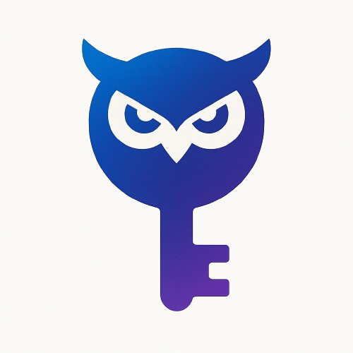

<div align="center">
  
  
  # OwlLock 🦉🔐
  
  **A secure, cross-platform password manager with owl-like vigilance**
  
  Built with Go and Vue.js for modern security needs
  
  [](LICENSE)
  [](https://golang.org)
  [](https://vuejs.org)
  [](https://wails.io)
</div>

---

## 📋 Table of Contents

- [About](#about)
- [Features](#features)
- [Screenshots](#screenshots)
- [Building](#building)
- [Configuration](#configuration)
- [License](#license)

## 🎯 About

OwlLock is a modern, secure password manager that combines the power of Go's backend performance with Vue.js's elegant frontend design. Like an owl vigilantly watching over the night, OwlLock keeps your digital credentials safe with advanced encryption and intuitive user experience.

### Why OwlLock?

- **🔒 Security First**: Your passwords are encrypted using industry-standard algorithms
- **🚀 Performance**: Built with Go for lightning-fast operations
- **🎨 Beautiful UI**: Modern Vue.js interface with attention to detail
- **🌍 Cross-Platform**: Native applications for Windows, macOS, and Linux
- **🔄 Offline First**: All data stored locally - you own your passwords

## ✨ Features

### Core Functionality
- 🔐 **Secure Password Storage** - SQLite database with AES encryption
- 🎲 **Advanced Password Generator** - Cryptographically secure random passwords
- 🔍 **Smart Search** - Quickly find your passwords with instant search
- 📋 **One-Click Copy** - Copy passwords to clipboard with ease
- 💾 **Backup & Restore** - Export/import your password database

### User Experience
- 🎨 **Modern Dark/Light Theme** - Beautiful interface that adapts to your preference
- 🌍 **Multi-Language Support** - Available in English and Turkish
- ⚡ **Fast & Responsive** - Native desktop performance
- 🎯 **Intuitive Navigation** - Clean, organized interface design

### Security Features
- 🦉 **System Fingerprinting** - Unique encryption based on system characteristics
- 🔑 **Master Password Protection** - Single password to access all credentials
- 🚫 **No Cloud Dependency** - All data stays on your device
- 🛡️ **Memory Protection** - Secure memory handling for sensitive data

### Technical Features
- ⚙️ **Configurable Settings** - JSON-based configuration system
- 🔧 **Developer Friendly** - Hot reload during development
- 📦 **Single Executable** - No installation dependencies required
- 🔄 **Auto-Update Ready** - Built-in update mechanism support

## 🖼️ Screenshots

*Screenshots will be added soon*

### Download Pre-built Binaries

1. Visit the [Releases](https://github.com/akifkadioglu/password-manager/releases) page
2. Download the appropriate version for your operating system:
   - **Windows**: `OwlLock-windows-amd64.exe`
   - **macOS**: `OwlLock-darwin-amd64.dmg`
   - **Linux**: `OwlLock-linux-amd64.AppImage`

### System Requirements

- **Windows**: Windows 10/11 (64-bit)
- **macOS**: macOS 10.14 or later
- **Linux**: Ubuntu 18.04+ or equivalent distribution

### Prerequisites

Make sure you have the following installed:

- [Go](https://golang.org/dl/) (1.21 or later)
- [Node.js](https://nodejs.org/) (16 or later)
- [Wails](https://wails.io/docs/gettingstarted/installation) v2

### Quick Start

1. **Clone the repository**
   ```bash
   git clone https://github.com/akifkadioglu/password-manager.git
   cd password-manager
   ```

2. **Install dependencies**
   ```bash
   # Install Go dependencies
   go mod tidy
   
   # Install frontend dependencies
   cd frontend
   npm install
   cd ..
   ```

3. **Set up configuration**
   ```bash
   cp config.example.json config.json
   ```

4. **Run in development mode**
   ```bash
   wails dev
   ```

The application will start with hot reload enabled. Any changes to the frontend will be automatically reflected.

### Development Server

For browser-based development, Wails provides a dev server at `http://localhost:34115` where you can access Go methods from the browser's developer tools.

## 🏗️ Building

### Build for Production

```bash
# Build for current platform
wails build

# Build for specific platforms
wails build -platform windows/amd64
wails build -platform darwin/amd64
wails build -platform linux/amd64
```

### Build Options

- **Release Build**: `wails build -clean`
- **Debug Build**: `wails build -debug`
- **Skip Frontend Build**: `wails build -s`

Built applications will be available in the `build/bin/` directory.

## ⚙️ Configuration

OwlLock uses a JSON configuration file (`config.json`) for customization:

```json
{
  "app": {
    "name": "OwlLock",
    "debug": false
  },
  "database": {
    "type": "sqlite",
    "name": "passwords.db"
  },
  "security": {
    "password_min_length": 6,
    "password_max_length": 128,
    "use_fingerprint": true
  },
  "ui": {
    "theme": "system",
    "language": "en",
    "window_width": 1200,
    "window_height": 800
  }
}
```

### Configuration Options

- **Theme**: `light`, `dark`, or `system`
- **Language**: `en` (English) or `tr` (Turkish)
- **Security**: Adjust password requirements and encryption settings
- **UI**: Customize window dimensions and behavior

### Getting Started

1. **First Launch**: Create your master password
2. **Add Passwords**: Click the "+" button to add new credentials
3. **Generate Passwords**: Use the built-in generator for strong passwords
4. **Search**: Use the search bar to quickly find credentials
5. **Backup**: Regular backups ensure your data is safe

### Security Best Practices

1. **Use a Strong Master Password** - This is your key to everything
2. **Regular Backups** - Export your database regularly
3. **Keep Software Updated** - Always use the latest version
4. **Secure Your Device** - Use device encryption and screen locks

### Development Process

1. Fork the repository
2. Create a feature branch (`git checkout -b feature/amazing-feature`)
3. Commit your changes (`git commit -m 'Add amazing feature'`)
4. Push to the branch (`git push origin feature/amazing-feature`)
5. Open a Pull Request

### Code Style

- Go code should follow `gofmt` standards
- Vue.js code should follow Vue 3 composition API patterns
- Use meaningful commit messages

## 📄 License

This project is licensed under the MIT License - see the [LICENSE](LICENSE) file for details.

---

<div align="center">
  Made with ❤️ by <a href="https://github.com/akifkadioglu">Akif Kadıoğlu</a>
  
  If you found this project helpful, please consider giving it a ⭐
</div>
